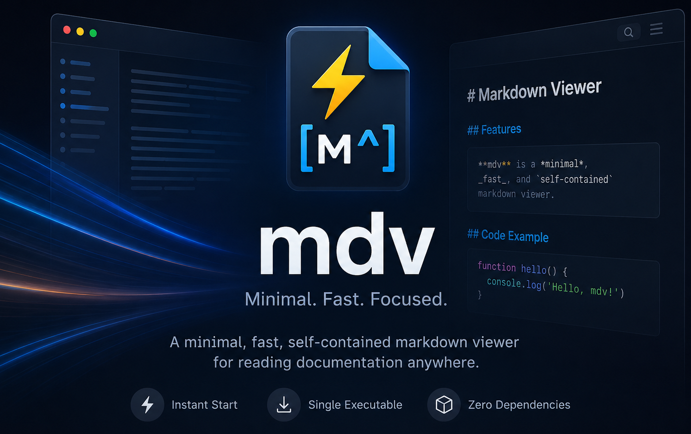

<br />
<div align="center">
  <a href="https://github.com/thgossler/mdv">
    
  </a>

  <h1 align="center">mdv</h1>

  <p align="center">
    A minimal, fast, self-contained markdown viewer for reading local markdown docs with seamless navigation. One executable, no installation, no dependencies.
    <br />

[](https://github.com/thgossler/mdv/releases/latest)
[](https://github.com/thgossler/mdv/actions/workflows/ci.yml)
[](https://github.com/thgossler/mdv/releases/latest)
[](https://github.com/thgossler/mdv/releases)
[](https://github.com/thgossler/mdv/issues)
[](https://github.com/thgossler/mdv/graphs/contributors)
[](https://github.com/thgossler/mdv/stargazers)
[](LICENSE.md)
[](https://github.com/sponsors/thgossler)

  </p>
</div>

`mdv` adapts to wherever it runs:

- **GUI** — a native-webview window with full rendering (default on desktops).
- **TUI** — a rich terminal UI when no graphical environment is available.
- **Console** — plain rendered output to stdout when piped or non-interactive.

It is built so it **always starts**, including inside headless Docker containers
over SSH: the distributed binary is a pure-Go launcher with **zero webview
linkage**, so missing `WebKitGTK`/GUI libraries never cause a failure. The GUI
is a separate helper embedded in the binary and only spawned when a graphical
environment is actually present.

## Install

No package managers needed — the install scripts download a single executable
from GitHub Releases.

**macOS / Linux:**

```sh
curl -fsSL https://raw.githubusercontent.com/thgossler/mdv/main/scripts/install.sh | sh
```

**Windows (PowerShell):**

```powershell
irm https://raw.githubusercontent.com/thgossler/mdv/main/scripts/install.ps1 | iex
```

The PowerShell installer is cross-platform — with PowerShell 7+ it also works on
macOS and Linux:

```sh
pwsh -c "irm https://raw.githubusercontent.com/thgossler/mdv/main/scripts/install.ps1 | iex"
```

Or download a binary directly from the [Releases](https://github.com/thgossler/mdv/releases)
page:

| Platform          | Asset                         |
| ----------------- | ----------------------------- |
| macOS (universal) | `mdv-darwin-universal.tar.gz` |
| Windows (x64)     | `mdv-windows-amd64.exe`       |
| Linux (amd64)     | `mdv-linux-amd64.tar.gz`      |
| Linux (arm64)     | `mdv-linux-arm64.tar.gz`      |

### Where it gets installed and how PATH is handled

| Platform      | Default location                                                                        | PATH handling                                                                                                                                          |
| -------------- | --------------------------------------------------------------------------------------- | ----------------------------------------------------------------------------------------------------------------------------------------------------- |
| Windows       | `%LOCALAPPDATA%\Programs\mdv\mdv.exe`                                                   | Added to your **user** `Path` (persisted for new terminals) and prepended to the current session.                                                      |
| macOS / Linux | `/usr/local/bin/mdv` if it is on your `PATH` and writable, otherwise `~/.local/bin/mdv` | If the chosen directory isn't already on `PATH`, the installer appends it to your shell profile (`.zshrc`, `.bashrc`, `.bash_profile`, or `.profile`). |

Set the `MDV_INSTALL` environment variable to install somewhere else (e.g.
`MDV_INSTALL=$HOME/bin`), and `MDV_VERSION` to pin a specific release tag.

Both installers make `mdv` usable in the **same shell**, with no restart or
manual `source` needed:

- The PowerShell installer, when run with the `irm … | iex` one-liner, executes
  in your current session and prepends the install directory to `$env:PATH`
  immediately.
- The POSIX installer prefers a directory that is already on your `PATH`, so the
  binary is found right away. If it has to fall back to `~/.local/bin`, it
  updates your profile for future shells and prints the one-line `export` to
  enable it in the current one (or run it sourced — `. install.sh` — to have the
  `PATH` update applied directly to your shell).

## Usage

```sh
mdv README.md            # open a single document
mdv ./docs               # open a folder (sidebar lists all markdown files)
mdv --tui README.md      # force the terminal UI
mdv --console README.md  # render to stdout and exit
mdv --version            # show current SemVer version number
mdv --init-config        # write a default settings.jsonc
```

| Flag              | Description                            |
| ----------------- | -------------------------------------- |
| `--tui`           | Force the interactive terminal UI      |
| `--gui`           | Force the graphical UI                 |
| `--console`, `-c` | Render to stdout and exit              |
| `--no-color`      | Disable ANSI colors in console output  |
| `--max-width N`   | Cap the render width to N columns      |
| `--images MODE`   | Image rendering: `auto`, `graphics`, `blocks`, `off` |
| `--version`       | Print version and exit                 |
| `--init-config`   | Write a default settings file and exit |

### Document content search

The document navigator can search inside your documents, not just filter by
filename:

- **GUI** — click the **⌕** toggle next to the navigator filter box. When
  enabled, each matching document is shown with its matching lines nested
  beneath it; click a match to open the document and jump straight to that line,
  highlighted like in-document search. Toggle it off again to return to plain
  filename/title filtering.
- **TUI** — in the document list press `/` to filter by name, or type `//` to
  switch to content search. Matches appear indented under each document; press
  Enter on a match to open the document and jump to it.

Search is case-insensitive and combines multiple space-separated keywords with
a logical **AND** (a document must contain every keyword). Only documents with a
filename or content match remain in the list. When [ripgrep](https://github.com/BurntSushi/ripgrep)
(`rg`) is installed it is used for fast searching; otherwise mdv falls back to a
built-in scan.

## Features

- GitHub Flavored Markdown (tables, task lists, strikethrough, autolinks)
- GitHub alerts (`> [!NOTE]`, `[!TIP]`, `[!IMPORTANT]`, `[!WARNING]`, `[!CAUTION]`)
- Math via KaTeX (`$inline$` and `$$block$$`)
- Mermaid diagrams (theme-aware)
- Syntax highlighting with 6 themes (Glyph, GitHub, Monokai, Nord, Solarized Light/Dark)
- Inline images in the console and terminal UI
- Wikilinks `[[doc]]`, `[[doc|alias]]`, `[[doc#heading]]` with a backlinks panel
- Table-of-contents sidebar with scroll-spy, heading anchors
- CSV/TSV fenced blocks rendered as tables
- YAML frontmatter metadata block, emoji shortcodes
- Azure DevOps constructs (`[[_TOC_]]`, `:::video:::`, `#123` work items)
- Sanitized inline HTML (DOMPurify)
- In-document search (Cmd/Ctrl+F), live reload, drag-and-drop
- Document content search in the navigator (ripgrep when installed, built-in fallback)
- Zoom (Cmd/Ctrl + wheel / +/-), light/dark/system themes, configurable fonts
- History navigation, link target preview in the status bar
- "Open in new window"
- Automatic update checks

## Configuration

`mdv` works with zero configuration. To customize, create
`~/.config/mdv/settings.jsonc` (or run `mdv --init-config`). The file is JSONC
(JSON with comments and trailing commas) and is merged over the built-in
defaults. On Windows/macOS the location follows `XDG_CONFIG_HOME` if set.

```jsonc
{
  // "system" | "light" | "dark"
  "theme": "system",
  "codeTheme": "github",
  "fontFamily": "",
  "fontSizePx": 16,
  "lineHeight": 1.6,
  "contentWidthPx": 860,
  "navLabelMode": "filename", // or "title"
  "liveReload": true,
  "checkForUpdates": true,
  "images": "auto", // "auto" | "graphics" | "blocks" | "off"
  "imagesRemote": true, // fetch http(s) images in console/TUI (falls back to alt text)
}
```

## Building from source

Requires Go 1.26+, Node.js 18+, and the [Wails v3](https://v3alpha.wails.io/)
CLI (`go install github.com/wailsapp/wails/v3/cmd/wails3@latest`).

```sh
scripts/build.sh          # macOS/Linux -> build/mdv
pwsh scripts/build.ps1    # Windows     -> build/mdv.exe
```

The script builds the frontend, compiles the GUI helper, compresses and embeds
it into the launcher, and produces a single self-contained executable. On macOS
the result is a universal (arm64 + amd64) binary.

### Architecture

```
cmd/mdv             pure-Go launcher (no webview linkage) — picks GUI/TUI/console
internal/core       shared logic: config, links, slugs, backlinks, updates
internal/console    glamour-based stdout rendering
internal/tui        Bubble Tea terminal UI
internal/launcher   environment detection + embedded GUI extraction/spawn
gui/                Wails v3 GUI helper (Go bridge + TypeScript frontend)
```

The launcher embeds the GUI helper (gzip-compressed) and extracts it to a
per-version cache directory on first GUI launch, then runs it detached. Because
the launcher itself links no native UI libraries, it starts cleanly in any
environment and degrades gracefully to TUI or console.

### Running the tests

The Go test suite covers both unit logic (config parsing, link/wikilink
resolution, slugging, backlinks, folder listing, version comparison) and
end-to-end CLI behavior (the built binary's `--version`, `--console`,
`--init-config`, and no-arg usage paths). It is the automated quality gate for
every pull request.

```sh
go test ./...                 # unit + end-to-end tests
go test -short ./...          # skip the slower e2e build test
go test -race -coverprofile=coverage.out ./...   # what CI runs
go tool cover -html=coverage.out                 # browse coverage
```

In VS Code, press <kbd>Cmd/Ctrl</kbd>+<kbd>Shift</kbd>+<kbd>P</kbd> →
**Tasks: Run Test Task**, or pick any of the `test*` / `coverage report` tasks
from the Command Palette.

## Contributing

Pull requests are warmly welcome — whether it's a one-character typo fix or a
whole new rendering feature. `mdv` is a small codebase on purpose, so it's an
approachable place to make your first open-source contribution. 🌱

**The quick path:**

1. **Fork** the repo and create a branch: `git checkout -b feature/amazing-thing`.
2. **Hack** away. Keep the launcher webview-free — that headless-safety guarantee
   is the whole point of the project, so anything touching native UI belongs in
   `gui/`, never in `cmd/mdv` or `internal/launcher`.
3. **Test** your change: `go test ./...` must stay green, and please add a test
   for anything you fix or add. The CI quality gate runs `go vet`, `gofmt`, the
   race detector, and the full suite — running them locally first saves a round
   trip.
4. **Format**: `gofmt -w .` for Go and `npx tsc --noEmit` in `gui/frontend` for
   the TypeScript side.
5. **Open a PR** with a clear description of the _why_, not just the _what_.
   Screenshots or a short clip for UI changes earn you bonus goodwill. ✨

**Good first issues:** new syntax-highlight themes, additional markdown
extensions, emoji shortcode coverage, TUI keybindings, and documentation polish
are all great starting points. Look for the
[`good first issue`](https://github.com/thgossler/mdv/labels/good%20first%20issue)
label.

**House rules:** be kind, assume good intent, and remember there's a human on
the other side of every review. By participating you agree to uphold a
welcoming, harassment-free environment for everyone.

## Sponsor

`mdv` is free, MIT-licensed, and built in spare evenings fueled by curiosity
(and a non-trivial amount of coffee ☕). If it saves you a few clicks every day,
consider giving a little back:

- ⭐ **Star the repo** — it's free, it takes two seconds, and it genuinely helps
  others discover the project.
- 💬 **Spread the word** — blog about it, tell a colleague, or drop it in your
  team's tooling channel.
- 🐛 **Report bugs and ideas** — high-signal issues are worth their weight in gold.
- 💖 **Back it financially** via 
  - [GitHub Sponsors](https://github.com/sponsors/thgossler) or 
  - [PayPal](https://www.paypal.com/donate/?hosted_button_id=JVG7PFJ8DMW7J).
  
  — every tier, down to "buy the maintainer a coffee," keeps the lights on and
  the commits coming.

Sponsorships directly fund maintenance time, code-signing certificates, and the
occasional release-day pizza. Thank you for keeping independent open source
alive. 🙏

## License

Released under the [MIT License](LICENSE.md) — do what you like, just keep the
copyright notice. 

Copyright © 2026 Thomas Gossler
